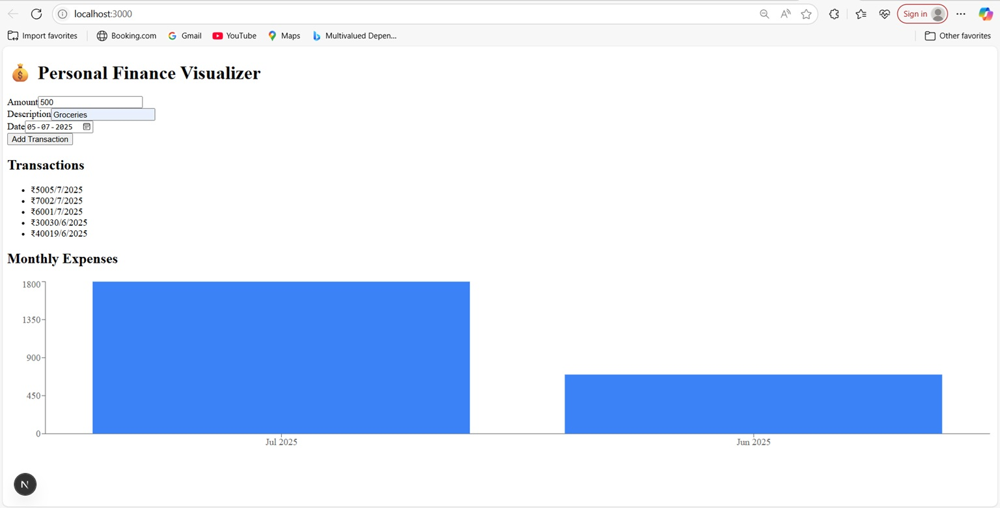
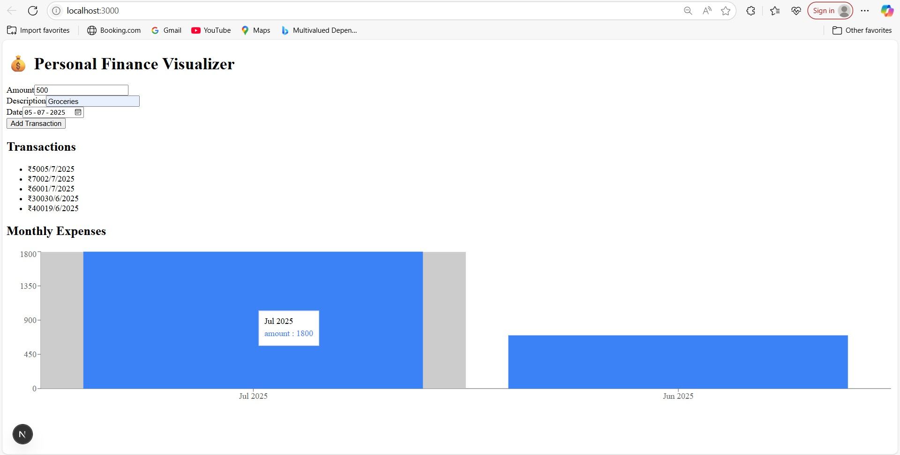

💰 Personal Finance Visualizer A simple and responsive web application to track personal finances.

---

🚀 Features – Stage 1

- ✅ Add new transactions (amount, date, description)
- ✅ View list of all transactions
- ✅ Monthly expenses bar chart using Recharts
- ✅ Basic form validation for empty fields
- ✅ Responsive UI using shadcn/ui components

---
📦 Getting Started Locally

1. Clone the repository
```bash
git clone https://github.com/Aditibhoir/personal-finance-visualizer.git
cd personal-finance-visualizer
2. Install dependencies

npm install
3. Create .env.local file

MONGODB_URI=your_mongodb_connection_string
📌 Use your MongoDB Atlas connection string in place of your_mongodb_connection_string

4. Start the development server

npm run dev
Open http://localhost:3000 in your browser to see the app
---
📸 Screenshots

📋 Home Page – Add & View Transactions  


📊 Monthly Expenses Bar Chart  



🌐 Live Demo
🔗 Deployed on Vercel: https://your-vercel-app-url.vercel.app

Replace with your actual deployed URL once deployed.


Made with love @Aditibhoir

💰 Personal Finance Visualizer

A simple and responsive web application to track personal finances.

---

🚀 Features – Stage 1

- ✅ Add new transactions (amount, date, description)
- ✅ View list of all transactions
- ✅ Monthly expenses bar chart using Recharts
- ✅ Basic form validation for empty fields
- ✅ Responsive UI using shadcn/ui components

---

🛠️ Tech Stack

| Layer     | Technology                          |
|-----------|-------------------------------------|
| Frontend  | Next.js (App Router), React         |
| Styling   | Tailwind CSS, shadcn/ui             |
| Charts    | Recharts (Bar Chart)                |
| Backend   | API Routes (Next.js)                |
| Database  | MongoDB Atlas (via Mongoose ODM)    |

---

📦 Getting Started Locally

1. Clone the repository
```bash
git clone https://github.com/Aditibhoir/personal-finance-visualizer.git
cd personal-finance-visualizer
2. Install dependencies

npm install
3. Create .env.local file

MONGODB_URI=your_mongodb_connection_string
📌 Use your MongoDB Atlas connection string in place of your_mongodb_connection_string

4. Start the development server

npm run dev
Open http://localhost:3000 in your browser to see the app.

📸 Screenshots

📋 Home Page – Add & View Transactions  


📊 Monthly Expenses Bar Chart  


